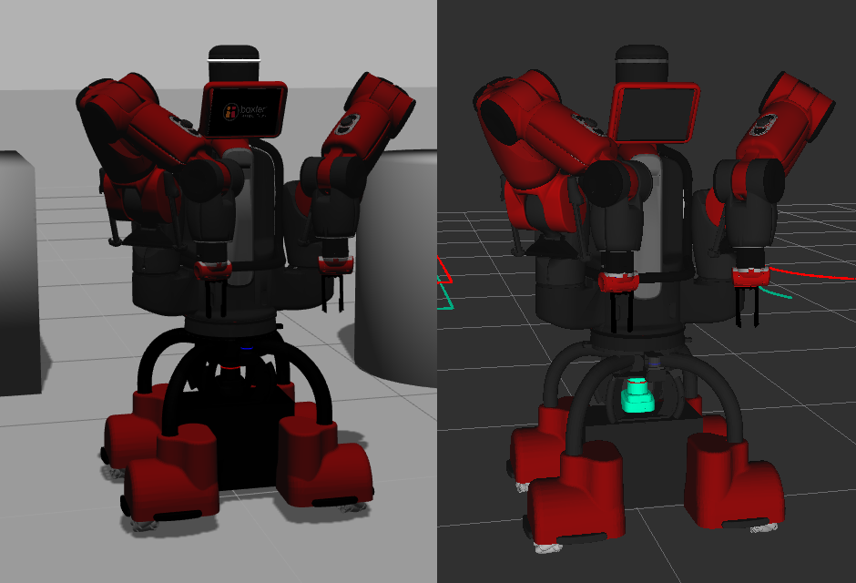

# mobility_base_simulator

# Code & Tickets
| | |
|-|-|
|**Tutorial**      | [Tutorial](Tutorial.md) |
|**Documentation** | http://mbsdk.dataspeedinc.com |
|**Issues**        | https://bitbucket.org/dataspeedinc/mobility_base_simulator/issues |

# mobility_base_simulator Repository Overview
| | |
|-|-|
| **mobility_base_gazebo/**            | launch files for simulating the Mobility Base 
| **mobility_base_gazebo_plugins/**    | plugins to gazebo for the Mobilty Base
| **mobility_base_simulator/**         | mobility_base_simulator metapackage
